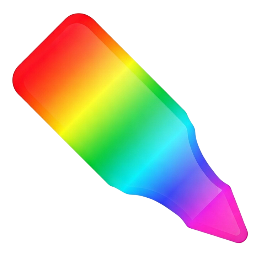

# Crayon: custom CSS injector

Heya! This is a fork of [CustomCSS Injector](https://github.com/blizz31/customcssinjector/)

Why did I fork it? Here is what I did:

- Updated 3rd-party libraries (Prism and Bliss)
- Improved the pop-up UX (you no longer have to click just on the little dot)
- Improved granularity: you can now use global, domain and URL rules in tandem instead of them being mutually exclusive for some reason.
- Most importantly: **an overview page**, accessible via the "see all your rules" button in the pop-up
	- See all the rules you have saved
	- Export/import

### Licence

Like the original, this project is under the [GNU GPL v3](LICENCE).